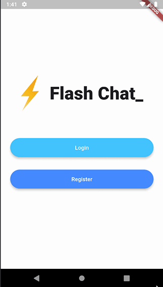

# flutter_flash_chat

## Version 1.0.0

A Simple Chat Application with Firebase.

### Features

- Real-time messaging with Firestore
- User authentication with Firebase Auth
- Message timestamps for proper ordering

### Packages used

- [animated_text_kit: ^4.2.2](https://pub.dev/packages/animated_text_kit)
- [firebase_core: ^3.2.0](https://pub.dev/packages/firebase_core)
- [firebase_auth: ^5.1.2](https://pub.dev/packages/firebase_auth)
- [cloud_firestore: ^5.1.0](https://pub.dev/packages/cloud_firestore)
- [loading_overlay: ^0.3.0](https://pub.dev/packages/loading_overlay)

### Installation

#### Android

Download the APK from
the [releases page](https://github.com/abdulrehmana28/flutter_flash_chat/releases/tag/v1.0.0).

## Demo

